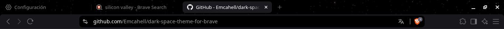

# Dark Space Theme - Brave/Chrome Browser Theme

Dark space theme with starfield background for Brave and Chrome browsers.



## Features

- Starfield background image
- Dark theme colors for browser UI
- Custom tab bar and toolbar styling
- Compatible with Chrome and Brave browsers
- Manifest V2 support

## Installation

### Chrome
1. Download or clone this repository
2. Open Chrome and go to `chrome://extensions/`
3. Enable "Developer mode" in the top right
4. Click "Load unpacked" and select the theme folder
5. The theme will be applied automatically to the browser

### Brave
1. Download or clone this repository
2. Open Brave and go to `brave://extensions/`
3. Enable "Developer mode" in the top right
4. Click "Load unpacked" and select the theme folder
5. The theme will be applied automatically to the browser

## What it Changes

- Tab bar background and colors
- Toolbar colors
- New tab page background (starfield image)
- Button colors and tints
- Bookmark text colors

## Development

To regenerate the theme images and icons, run:
```bash
python3 generate_icons.py
```

This requires Python 3 and Pillow (PIL):
```bash
pip3 install pillow
```

## License

This project is licensed under the GNU General Public License v3.0. See the [LICENSE](LICENSE) file for details.

This means:
- You are free to use, modify, and distribute this theme
- Any derivative works must also be open source under the GPL-3.0 license
- The theme must remain free and open source